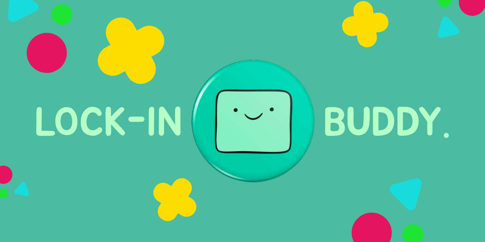

# Lock-In Buddy

A productivity-focused robot buddy paired with a desktop app designed to help users stay locked in! 

---

## ✨ Features

- **Real-time focus detection** — uses your webcam to track head pose every frame and detect when you look away or down
- **Phone detection** — optionally flags when a cell phone appears in the camera frame
- **Strike system** — accumulates up to 3 strikes before ending the session; BMO reacts with escalating reactions
- **Pomodoro-style timer** — configurable session lengths for Lock In (default 25 min), Short Break (5 min), and Long Break (15 min)
- **Calibration** — capture your natural seated head position so detection is tuned to you, not a generic default
- **Persistent settings** — timer durations are saved locally and restored on next launch
- **Desktop notifications** — notifies you when a session ends even if the window is in the background
- **Mode themes** — the UI color scheme changes per mode (Lock In, Short Break, Long Break)
- **WebSocket state streaming** — backend pushes focus state updates in real time over a WebSocket connection

---

## 🗂️ Architecture

```
lockin_frontend/          React + TypeScript + Tauri desktop shell
  src/
    components/           UI screens (WelcomeScreen, MainPage, RunningScreen,
                           Calibration, SettingsScreen, ...)
    hooks/
      useTimer.ts         Countdown logic with session-end notification
      useDetectionSession.ts  WebSocket client — streams focus state from backend,
                               drives the strike system
      notifications.ts    Tauri notification bridge
    modes/
      themeByMode.ts      Per-mode colors + default timer lengths
      types.ts            Shared TypeScript types

main.py                   FastAPI app — HTTP + WebSocket API layer

lockin_backend/           Python detection package
  camera.py               CameraManager — owns cv2.VideoCapture + FaceLandmarker,
                           opened once at startup so both modes share it instantly
  faceService.py          Lock-in detection loop (head pose + phone detection)
                           → emits raw DetectionState per frame
  faceCalibration.py      Calibration-only loop — lightweight preview + pose capture,
                           no state machine or callbacks
  stateMachine.py         Debounce layer — requires N seconds of distraction before
                           escalating to ALERT; enforces cooldown between alerts
  schemas.py              Shared Pydantic models (DetectionState, CalibrationData, ...)
  models/                 MediaPipe .task model files
```

**Data flow (Lock In session):**

```
Webcam
  │
  ▼
CameraManager.read_frame() + detect_landmarks()   (shared, always open)
  │
  ▼
FaceService._classify()     head pose + phone check → raw DetectionState / frame
  │
  ▼
StateMachine.feed()         debounce → stable state (LOCKED_IN / DISTRACTED / ALERT)
  │  WebSocket broadcast
  ▼
useDetectionSession (React hook)   increments strike count on ALERT
  │
  ▼
MainPage / RunningScreen    BMO reacts, session ends at 3 strikes
```

**Calibration flow:**

```
User opens Calibration screen
  → FaceService stops (releases frame loop)
  → FaceCalibration starts (lightweight loop, same shared camera)
  → MJPEG preview streams to the UI
  → User clicks "Lock In!" → pose captured + saved to calibration.json
  → FaceCalibration stops → next session uses the saved pose
```

---

## 🛠️ Tech Stack

**Frontend**
- React + TypeScript
- Tauri
- Tailwind CSS

**Backend**
- Python + FastAPI
- MediaPipe (face landmark detection)
- OpenCV
- WebSockets (real-time state streaming)

---

## 📦 Installation

### Prerequisites
For Tauri: https://tauri.app/start/prerequisites/

For React: Node.js https://nodejs.org/en/download

For Python backend: Python 3.11+ and pip

### Setup

```bash
# Clone the repo
git clone https://github.com/your-username/lockin-buddy.git

# Install Python dependencies (from project root)
pip install -r requirements.txt

# Install frontend dependencies
cd lockin_frontend
npm install
cd ..
```

---

### Running — Windows

Use the provided batch scripts from the **project root**:

| Script | What it does |
|---|---|
| `.\start.bat` | Starts the backend + Tauri frontend (normal use) |
| `.\start.debug.bat` | Starts the backend only in debug mode (OpenCV preview window + session auto-started) |

Or run manually in two terminals:

```powershell
# Terminal 1 — backend
python -m uvicorn main:app --reload

# Terminal 2 — frontend
cd lockin_frontend
npm run tauri dev
```

---

### Running — Mac

Use the provided shell scripts from the **project root**. Make them executable once after cloning:

```bash
chmod +x start.sh start.debug.sh
```

| Script | What it does |
|---|---|
| `./start.sh` | Starts the backend in a new Terminal window, then launches the Tauri frontend |
| `./start.debug.sh` | Starts the backend only in debug mode (OpenCV preview window + session auto-started). Press Enter to stop. |

> **Note:** The scripts use macOS's built-in Terminal.app to open the backend in a separate window. If you use iTerm2 or another terminal emulator the backend window may not open automatically, but the server will still start — you can open the debug preview at `http://localhost:8000/debug/preview`.

Or run manually in two terminals:

```bash
# Terminal 1 — backend (from project root)
python3 -m uvicorn main:app --reload

# Terminal 2 — frontend
cd lockin_frontend
npm run tauri dev
```

---

## ⚠️ Disclaimer

This project was created for **KnightHacks Project Launch 2026** solely for education purposes.

This project includes a design inspired by BMO from Adventure Time.

BMO is a character owned by Cartoon Network.
This project is for educational and non-commercial purposes only.
No copyright infringement is intended.
This project is not affiliated with or endorsed by Cartoon Network.

